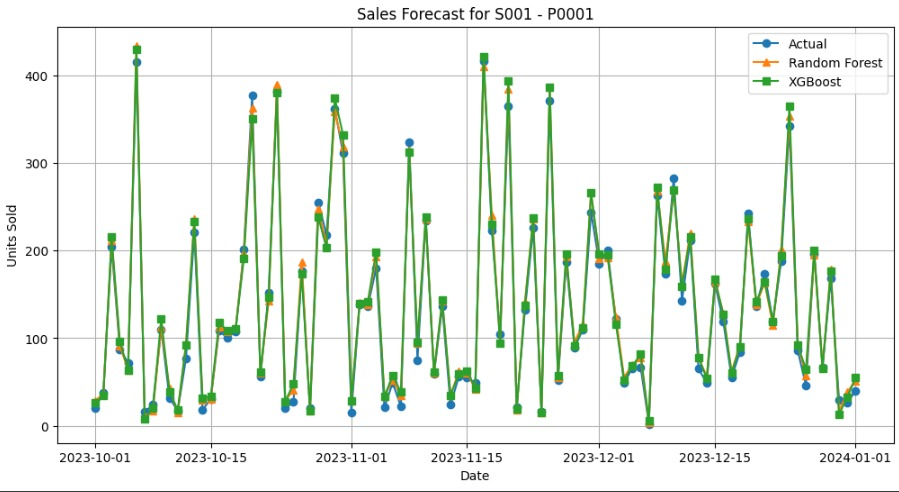
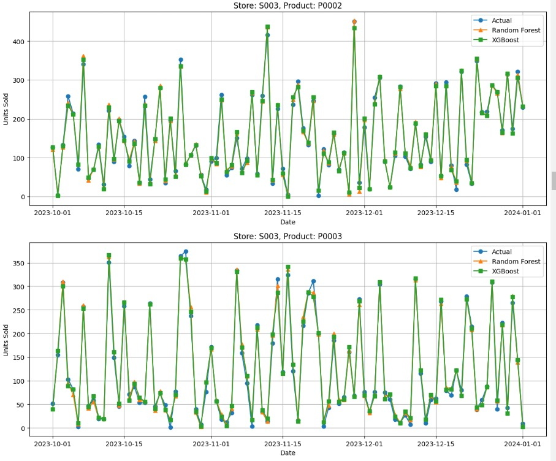

# 🛒 Retail Sales Forecasting using Machine Learning

> 📊 Capstone project to forecast daily sales of products across retail stores using historical inventory and contextual data. Built using Python, Random Forest, XGBoost, and interactive dashboards in Streamlit and Jupyter.

---

## 🚀 Project Overview

This project focuses on *forecasting product-level daily sales* across multiple retail stores using machine learning. Leveraging a structured dataset from a retail inventory system, we use:
- *Random Forest Regressor*
- *XGBoost Regressor*

to predict Units Sold based on features like pricing, discounts, weather, holidays, seasonality, and past demand.

---

## 📂 Dataset Information

- *Source*: [Kaggle - Retail Store Inventory Forecasting Dataset](https://www.kaggle.com/datasets/anirudhchauhan/retail-store-inventory-forecasting-dataset)
- *Time Frame*: Jan 2022 to Dec 2023
- *Data Points*:
  - Store ID, Product ID, Date
  - Price, Discount, Competitor Pricing
  - Weather Condition, Seasonality, Category, Region
  - Inventory Level, Holiday/Promotion
  - Units Sold (Target)

---

## 🧠 Model Workflow

1. *Data Cleaning & Preprocessing*
   - Convert dates, sort, handle missing values
   - Create Effective Price, Price Diff
   - Generate lag features (lag_1, lag_7)

2. *Feature Engineering*
   - One-hot encode categorical columns
   - Use DayOfWeek as a time-aware variable

3. *Model Training*
   - Train Random Forest and XGBoost models per product-store combination
   - Evaluate with MAE, RMSE, MAPE

4. *Prediction Interface*
   - Custom form for on-the-fly forecasting (Jupyter)
   - Colab-compatible prediction on custom datasets
   - Support for feature input and model selection

---

## 📊 Model Evaluation

We benchmarked the models using:
- *MAE (Mean Absolute Error)*
- *RMSE (Root Mean Squared Error)*
- *MAPE (Mean Absolute Percentage Error)*

> 📈 Random Forest consistently gave robust results across most product-store combinations. XGBoost showed slight advantage for some seasonal items.

---

## 🧪 Predict on Custom Dataset (Colab)

This project includes a *Colab-compatible prediction pipeline*:

- Upload your .csv dataset (same format as training)
- Auto-preprocessing with lags and encoding
- Model-based predictions + visual forecast charts
- Support for scaler.pkl, rf_model.pkl, and xgb_model.pkl

##  Results 📊

